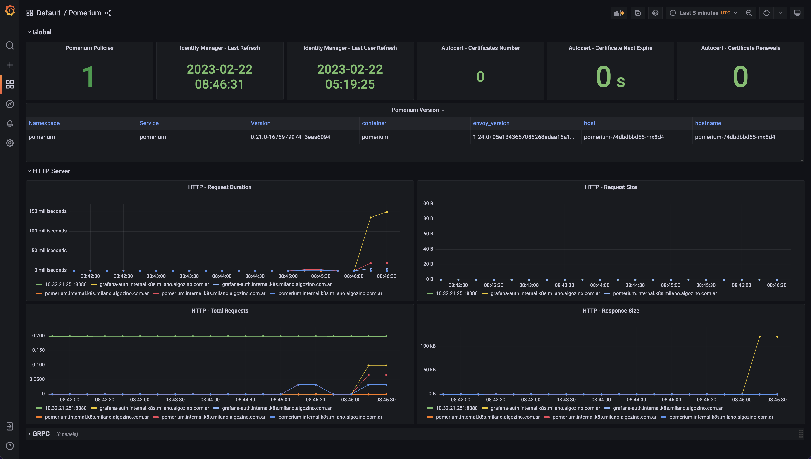
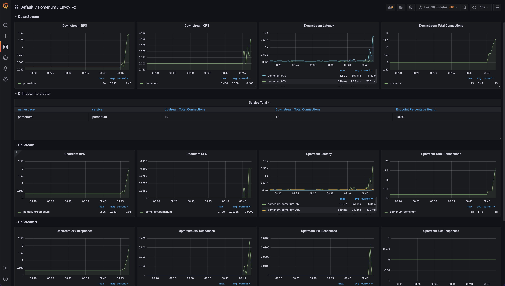
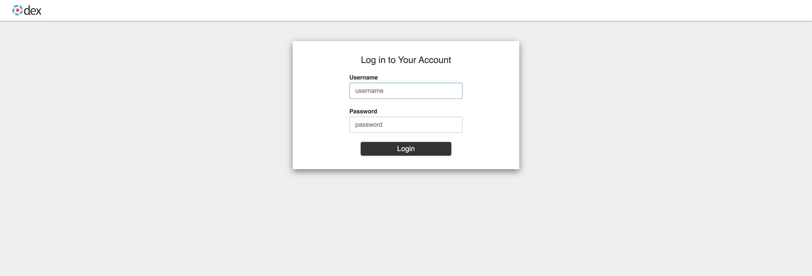
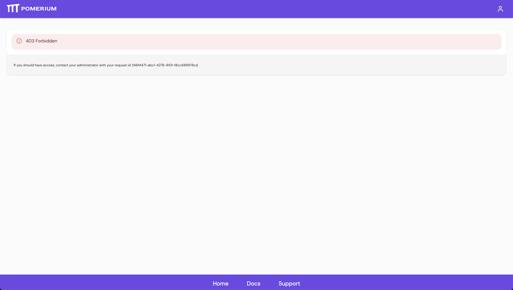
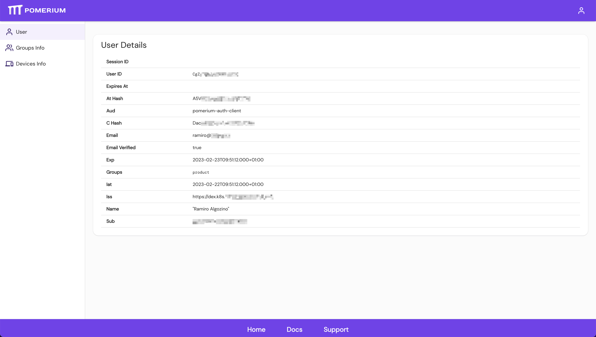

<!-- markdownlint-disable MD033 -->
<h1>
    
    Kubernetes Fury Auth
</h1>
<!-- markdownlint-enable MD033 -->


<!-- <KFD-DOCS> -->
**Kubernetes Fury Auth** provides Authentication Management for [Kubernetes Fury Distribution (KFD)][kfd-repo].

If you are new to KFD please refer to the [official documentation][kfd-docs] on how to get started with the distribution.

## Overview

**Kubernetes Fury Auth** uses CNCF recommended, Cloud Native projects, such as the [Dex][dex-repo] identity provider, and [Pomerium][pomerium-repo] as an identity-aware proxy to enable secure access to internal applications.

## Packages

Kubernetes Fury Auth provides the following packages:

| Package                       | Version   | Description                                                                       |
| ----------------------------- | --------- | --------------------------------------------------------------------------------- |
| [Pomerium](katalog/pomerium)  | `v0.25.0` | Identity-aware proxy that enables secure access to internal applications.         |
| [Dex](katalog/dex)            | `v2.38.0` | Dex is a Federated OpenID Connect Provider.                                       |
| [Gangplank](katalog/gangplank)| `0.1.0`   | Enable authentication flows via OIDC for a kubernetes cluster.                    |

## Compatibility

| Kubernetes Version |   Compatibility    | Notes            |
| ------------------ | :----------------: | ---------------- |
| `1.26.x`           | :white_check_mark: | No known issues. |
| `1.27.x`           | :white_check_mark: | No known issues. |
| `1.28.x`           | :white_check_mark: | No known issues. |
| `1.29.x`           | :white_check_mark: | No known issues. |

Check the [compatibility matrix][compatibility-matrix] for additional information on previous releases of the modules.

## Usage

### Prerequisites

| Tool                        | Version   | Description                                                                                                                                                    |
| --------------------------- | --------- | -------------------------------------------------------------------------------------------------------------------------------------------------------------- |
| [furyctl][furyctl-repo]     | `>=0.6.0` | The recommended tool to download and manage KFD modules and their packages. To learn more about `furyctl` read the [official documentation][furyctl-repo].     |
| [kustomize][kustomize-repo] | `>=3.5.0` | Packages are customized using `kustomize`. To learn how to create your customization layer with `kustomize`, please refer to the [repository][kustomize-repo]. |

### Deployment

1. List the packages you want to deploy and their version in a `Furyfile.yml`:

```yaml
versions:
    auth: "v0.2.0"
bases:
  - name: auth/pomerium
  - name: auth/dex
  - name: auth/gangplank
```

> See `furyctl` [documentation][furyctl-repo] for additional details about `Furyfile.yml` format.

2. Execute `furyctl vendor -H` to download the packages

3. Inspect the download packages under `./vendor/katalog/auth/`.

4. Define a `kustomization.yaml` that includes the `./vendor/katalog/auth` directory as a resource.

```yaml
resources:
  - ./vendor/katalog/auth/pomerium
  - ./vendor/katalog/auth/dex
  - ./vendor/katalog/auth/gangplank
```

5. Create the configuration file for Dex ([here's an LDAP-based example](katalog/dex/config.yml)) and add it as a secret to the `kustomization.yaml` file, like this:

```yaml
secretGenerator:
  - name: dex
    namespace: kube-system
    files:
      - config.yml=./secrets/dex/config.yml
```

> ℹ️ read more on [Dex's readme](katalog/dex/README.md).

⛔️ Before proceeding, follow the instructions in [Pomerium's package readme](katalog/pomerium/README.md) and [Gangplank's readme](katalog/gangplank/README.md) to configure them.

6. Finally, to deploy the module to your cluster, execute:

```bash
kustomize build . | kubectl apply -f -
```

### Monitoring

KFD Auth module integrates out-of-the-box with KFD's Monitoring module. Providing metrics and dashboards to visualize the status of its components.

In particular:

- Dex exposes standard Go adapter metrics, the metrics are automatically scrapped by Prometheus when using KFD Monitoring module but there are no Grafana dashboards nor alerts defined.
- Pomerium exposes several metrics about Pomerium itself and its underlying envoy proxy. Metrics are scrapped automatically by Prometheus and 2 Grafana dashboards are available with the `pomerium` tag when using KFD Monitoring module. Here are some screenshots:

<!-- markdownlint-disable MD033 -->

<a href="docs/images/screenshots/pomerium-dashboard.png"></a>
<a href="docs/images/screenshots/pomerium-envoy-dashboard.png"></a>

<!-- markdownlint-enable MD033 -->

### Screenshots

<!-- markdownlint-disable MD033 -->
- Dex Login:

<a href="docs/images/screenshots/dex.png"></a>

- Pomerium 403 not authorized error screen:

<a href="docs/images/screenshots/pomerium-403.png"></a>

- Pomerium user profile screen:

<a href="docs/images/screenshots/pomerium-userprofile.png"></a>

<!-- markdownlint-enable MD033 -->

<!-- Links -->
[furyctl-repo]: https://github.com/sighupio/furyctl
[kfd-repo]: https://github.com/sighupio/fury-distribution
[kustomize-repo]: https://github.com/kubernetes-sigs/kustomize
[kfd-docs]: https://docs.kubernetesfury.com/docs/distribution/
[compatibility-matrix]: https://github.com/sighupio/fury-kubernetes-auth/blob/master/docs/COMPATIBILITY_MATRIX.md
[pomerium-repo]: https://github.com/pomerium/pomerium
[dex-repo]: https://github.com/dexidp/dex
<!-- </KFD-DOCS> -->

<!-- <FOOTER> -->
## Contributing

Before contributing, please read first the [Contributing Guidelines](docs/CONTRIBUTING.md).

### Reporting Issues

In case you experience any problems with the module, please [open a new issue](https://github.com/sighupio/fury-kubernetes-auth/issues/new/choose).

## License

This module is open-source and it's released under the following [LICENSE](LICENSE)
<!-- </FOOTER> -->
